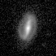
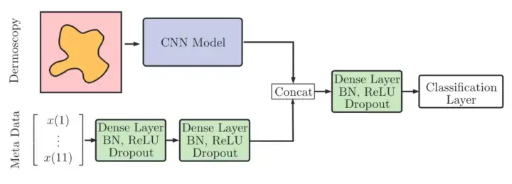

# Deloitte AstroHack Competition - Galileo Vision (2nd Place Solution)

Author: John Calzaretta

Date: 05/19/2020

---

# Competition
In 2020, the Deloitte AI Guild hosted an internal Kaggle-style competition using black-and-white images of galaxies from the Sloan Digital Sky Survey (SDSS) [[1]](#1). The objective was to build a machine learning model that can accurately predict the Mass-to-Luminosity (M/L) ratio for each galaxy. For each galaxy, an image at 128px and 69px quality was available, along with a set of size and distance metrics in tabular format.

Figure. 1 - Example Galaxy Image from SDSS

# Summary of Solution
My solution aimed to effectively incorporate the tabular information along with the image data. I experimented with training a CNN regression model, and then passing the fully connected layers weight to an XGB model along with the tabular metric data. However, my top-performing solution utilized a multimodal model that trained on the image and tabular data jointly. The model training was done using the fastai library built on PyTorch, and relied on an image_tabular API [[2]](#2). The final model transfer learns by fine-tuning a pretrained VGG19 model for images that is concatenated with a simple Dense NN model at the fully connected layer so that the final model is fit on both sets of information jointly. This solution achieved a MSE of 0.48 on the test set.

Figure. 2 - Multimodal Architecture Diagram using Image_Tabular API (Tian 2020)

# Future Improvement
The winning solution employed the model zoo approach and ensembled predictions from a set of ~10 pretrained CNN models. The key differentiator of this approach was its ability to account for outliers, which my solution did not effectively handle.

# References 

<a id="1">[1]</a> 
Sdss-Webmaster@sdss.org. Sloan Digital Sky Survey, https://classic.sdss.org/. 

<a id="2">[2]</a> 
Tian, Yuan. “Integrating Image and Tabular Data for Deep Learning.” Medium, Towards Data Science, 17 June 2020, https://towardsdatascience.com/integrating-image-and-tabular-data-for-deep-learning-9281397c7318#:~:text=Basically%2C%20we%20first%20load%20the,network%20to%20generate%20final%20predictions

